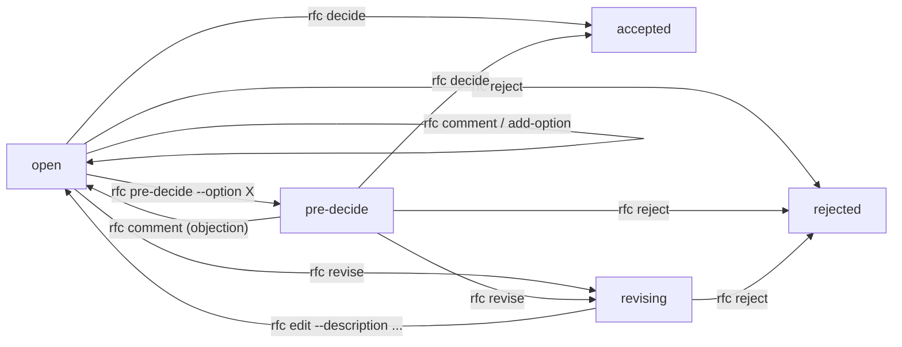

# RFC mechanism — end-to-end guide (v2, PR8g)

Cross-references: [PROTOCOL](./PROTOCOL.md) for exact command semantics,
[SCHEMA](./SCHEMA.md) for on-disk shapes, [HANDBOOK](./HANDBOOK.md) for
when (not) to open an RFC.

This document is the narrative companion to those references. It
covers the model, the lifecycle (now multi-state in PR8g), the
visibility rules, the on-disk layout, and a worked end-to-end
simulation that exercises the full v2 surface: multi-round discussion,
threaded comments, an option added mid-discussion, a pre-decision that
gets objected, a revise → edit cycle, and finally a clean decide.

> **Schema break notice (PR8g, alpha-only).** Comments moved from
> per-role JSON files (`comments/<role>.json`) to a single threaded
> ledger (`comments.yaml`) per RFC. No automatic migrator — projects
> created before alpha.15 must be re-initialised or hand-migrated.
> The CLI detects the legacy layout on read and refuses with a clear
> error.

---

## 1. What an RFC is, and why it exists

RFC = Request For Comments. It gives "decisions that cross multiple
roles' `owns`" a structured paper trail so that no single agent
unilaterally changes something other agents are responsible for.

Where it sits among the other channels:

| Channel  | Use for                                                                            | Visible to                        |
|----------|------------------------------------------------------------------------------------|-----------------------------------|
| chat     | non-durable. If it matters, it goes elsewhere.                                     | only that window                  |
| worklog  | broadcast progress note ("I changed config X").                                    | every role                        |
| report   | directed request ("Backend, please ship feature Y").                               | one role                          |
| **RFC**  | **a decision that needs comments from several roles and explicit sign-off**.       | voters + deciders + creator       |

An RFC is **not**:

- a vote (no automatic tally; the decider picks, period),
- a discussion forum (use worklogs / reports for that),
- a way to nag others (use reports),
- a way to formalise something inside your own `owns` (just do it).

---

## 2. Three participation roles, per RFC

Each RFC partitions the project's roles into three buckets, set at
**creation time** (`--voters`, `--deciders`, plus the implicit creator):

| Bucket          | Set by                                                                                  | What they can do                                                                       |
|-----------------|------------------------------------------------------------------------------------------|----------------------------------------------------------------------------------------|
| **creator**     | implicit (caller's `MA_SESSION`, or `SYSTEM`)                                            | call `rfc new`; rewrite via `rfc edit` while `revising`. May or may not also be voter / decider. |
| **voters**      | `--voters X,Y` (optional, may be empty)                                                  | should comment; appear in their `plan.rfcs` until they have read the latest discussion. |
| **deciders**    | `--deciders Z` (required, non-empty)                                                     | the **only** roles that can call `rfc pre-decide` / `rfc decide` / `rfc reject` / `rfc revise`. Non-deciders get `exit 9 FORBIDDEN`. |

Roles in none of those three buckets do not see the RFC in their
manifest. They can still inspect it with `agentctl rfc show <id>`
(reads are unrestricted), but it does not draw their attention.

There is **no role-level "default decider" flag**. Decider scope is
per-RFC. The handbook tells the agent opening an RFC how to pick
`--deciders` (roles whose `owns` overlap the decision + the top of
the relevant `reportsTo` chain).

---

## 3. Lifecycle and state machine (v2)



Key invariants:

- **`open`** is the discussion state. Anyone can `comment`. Any session
  can `add-option`. A decider can decide directly, pre-decide, or
  revise.
- **`pre-decide`** is the "I lean X, anyone object?" round. The
  proposal carries a `preDecision` field naming the pre-decider, the
  chosen option, ts, and rationale. Voters either stay silent (silent
  consent) or comment. **Any comment from a role other than the
  pre-decider auto-reopens the RFC to `open` and emits
  `RFC_PRE_DECISION_OBJECTED`.** The pre-decider may comment to add
  clarification without aborting their own round.
- **pre-decide is optional.** A decider may go straight to `decide`
  when the choice is unambiguous; pre-decide is for cases where you
  can imagine an objection.
- **`revising`** means "topic is real but the writeup is too thin —
  please rewrite". Only `rfc edit` (by creator or decider) takes it
  out, back to `open`. Voters do not appear in `manifest.rfcs` while
  the RFC is in revising; the creator and deciders do.
- **`accepted` / `rejected` / `superseded`** are terminal. `superseded`
  is reserved (no command produces it in v2; document supersession in
  a new RFC's rationale).
- `add-option` is allowed only in `open` and `revising` — adding mid-
  pre-decide would silently change what voters were asked to ACK.
- `decide` is valid from `open` and `pre-decide`. `reject` additionally
  works from `revising` (give up on the topic rather than waiting for
  a rewrite).
- The framework **does not auto-expire** open RFCs. `deadline` is a
  decorative field.
- There is **no auto-tally**. Even if every voter prefers option A,
  nothing happens until a decider explicitly calls `rfc decide
  --option A`.

---

## 4. On-disk layout (v2)

```
.multi-agent/
  config.yaml                                       # rfcCounter: N
  rfcs/RFC-NNNN-<slug>/
    proposal.yaml                                   # carries status, description, relatedTasks, preDecision
    comments.yaml                                   # threaded ledger; append-only across the RFC lifetime
    decision.json                                   # absent until a decider acts; terminal
  comms/cursors/<role>/rfc-<id>.json                # per-role read marker for unreadComments
  comms/events/<ulid>.json                          # RFC_* events (see table below)
```

`RFC-NNNN` is allocated atomically from `config.yaml:rfcCounter` under
the shared `config-yaml` lock (PR8c). `slug` is checked for global
uniqueness at creation time and refused if reused.

A representative `proposal.yaml`:

```yaml
id: RFC-0001
slug: switch-to-postgres
title: Move primary store from SQLite to Postgres
status: open                                # open | pre-decide | revising | accepted | rejected | superseded
voters: [DevOps, PM]
deciders: [TL]
options:
  - id: A
    summary: "Migrate now (4 weeks)"
  - id: B
    summary: "Add WAL tuning to SQLite first"
deadline: null
createdAt: 2026-05-28T03:18:42.117Z
createdBy: Backend
description: |
  Login latency tracked back to SQLite write contention under concurrent
  user load. Both options below are tractable; this RFC picks one.

  A: Migrate to Postgres on managed RDS. ~4 weeks of work; needs DevOps
  to stand up staging + production clusters. Schema changes are minimal.
  B: Tune SQLite WAL + busy-timeout. ~2 days of work; ceiling around
  3-4x current write throughput. Pushes the same decision out 3 months.
relatedTasks: [T-0042]
# preDecision: absent when status != pre-decide; when present:
# preDecision:
#   decidedBy: TL
#   chosenOption: A
#   ts: 2026-05-28T06:00:00.000Z
#   rationale: "lean A; want DevOps and PM to confirm migration window."
```

A representative `comments.yaml`:

```yaml
- id: 01HZA000000000000000COMM1
  rfcId: RFC-0001
  role: DevOps
  ts: 2026-05-28T05:02:00.000Z
  preferred: A
  replyTo: null
  rationale: "Migration is straightforward; Postgres is already in staging."

- id: 01HZA000000000000000COMM2
  rfcId: RFC-0001
  role: PM
  ts: 2026-05-28T05:15:00.000Z
  preferred: ""
  replyTo: 01HZA000000000000000COMM1
  rationale: "Can M2 slip 2 weeks if needed? If yes, fine with A."

- id: 01HZA000000000000000COMM3
  rfcId: RFC-0001
  role: Backend
  ts: 2026-05-28T05:30:00.000Z
  preferred: A
  replyTo: 01HZA000000000000000COMM2
  rationale: "Yes — M2 slip 2 weeks is acceptable for the new data layer."
```

A representative `decision.json`:

```json
{
  "rfcId": "RFC-0001",
  "decidedBy": "TL",
  "ts": "2026-05-28T07:42:11.443Z",
  "outcome": "accepted",
  "chosenOption": "A",
  "rationale": "Approved option A. Backend leads migration; ..."
}
```

The event stream gets these RFC-related event types (all broadcast,
`to: "*"`):

| Event                          | Triggered by                                                                                          |
|--------------------------------|-------------------------------------------------------------------------------------------------------|
| `RFC_CREATED`                  | `agentctl rfc new`                                                                                    |
| `RFC_COMMENT`                  | `agentctl rfc comment`                                                                                |
| `RFC_OPTION_ADDED`             | `agentctl rfc add-option`                                                                             |
| `RFC_PRE_DECISION`             | `agentctl rfc pre-decide`                                                                             |
| `RFC_PRE_DECISION_OBJECTED`    | a non-pre-decider role posts an `rfc comment` while status is `pre-decide`; auto-reopens to `open` |
| `RFC_REVISION_REQUESTED`       | `agentctl rfc revise`                                                                                 |
| `RFC_REVISED`                  | `agentctl rfc edit`                                                                                   |
| `RFC_DECIDED`                  | `agentctl rfc decide` / `agentctl rfc reject`                                                         |
| `RFC_TASK_LINKED` / `RFC_TASK_UNLINKED` | `agentctl rfc link-task` / `unlink-task`                                                     |
| `RFC_REPAIRED`                 | self-heal when a half-written decide is detected on read (PR8c)                                       |

---

## 5. Command reference

All commands need `MA_SESSION` exported.

| Command                                                                                                | Who                                | Notes                                                                                       |
|--------------------------------------------------------------------------------------------------------|------------------------------------|---------------------------------------------------------------------------------------------|
| `rfc new <slug> --title T --deciders D --options "A:s,B:s" [--description D] [--voters V] [--task T-NNNN] [--deadline ISO]` | any session | slug unique; `--deciders` non-empty; soft warn if `--description` empty                     |
| `rfc comment <rfc-id> --rationale R [--option X] [--reply-to <comment-id>]`                            | any session                        | RFC `open` or `pre-decide`; ledger append; auto-reopen rule for pre-decide                  |
| `rfc add-option <rfc-id> --option <id>:<summary> --rationale R`                                        | any session                        | RFC `open` or `revising`; option id unique within the RFC                                   |
| `rfc pre-decide <rfc-id> --option X --rationale R`                                                     | decider only                       | RFC `open`; sets `preDecision` and status to `pre-decide`                                   |
| `rfc decide <rfc-id> --option X --rationale R`                                                         | decider only                       | RFC `open` or `pre-decide`; final accept                                                    |
| `rfc reject <rfc-id> --rationale R`                                                                    | decider only                       | RFC `open` / `pre-decide` / `revising`; final reject                                        |
| `rfc revise <rfc-id> --rationale R`                                                                    | decider only                       | RFC `open` or `pre-decide`; rationale tells the creator what to fix                         |
| `rfc edit <rfc-id> --rationale R [--title T] [--description D] [--options A:s,B:s] [--deadline ISO]`   | creator OR decider                 | RFC `revising`; at least one of title/description/options/deadline; status flips to `open`  |
| `rfc link-task <rfc-id> --task T-NNNN`                                                                 | any session                        | task must exist; idempotent; refused in terminal states                                     |
| `rfc unlink-task <rfc-id> --task T-NNNN`                                                               | any session                        | idempotent; refused in terminal states                                                      |
| `rfc list [--status open|pre-decide|revising|accepted|rejected|superseded]`                            | anyone                             | reads on-disk only                                                                          |
| `rfc show <rfc-id> [--no-mark-seen]`                                                                   | anyone                             | side effect: advances this role's read cursor unless `--no-mark-seen`                       |

`FORBIDDEN` (exit 9): non-decider calling pre-decide / decide / reject /
revise; non-creator-non-decider calling edit. `USAGE` (exit 2): every
state-machine guard.

---

## 6. What appears in `agentctl plan`

`plan` returns `manifest.rfcs: RfcSummary[]` per role. The rules (PR8g):

1. Consider RFCs whose `status ∈ {open, pre-decide, revising}`.
2. Drop any RFC where the role is in neither `voters` nor `deciders`
   nor is the creator.
3. **`open`**: drop the voter (not also decider) only if they have
   commented AND have zero unread comments by others (means they have
   read everything since their last word).
4. **`pre-decide`**: decider always stays. Voter (not also decider)
   drops if they have commented AFTER the pre-decision ts (silent
   consent + actual disagreement both work via this rule).
5. **`revising`**: drop voters; keep creator + deciders.

Each entry shape:

```ts
{
  id: "RFC-0001",
  title: "...",
  status: "open" | "pre-decide" | "revising",
  role: "voter" | "decider",       // decider wins when both apply
  commented: boolean,                // this role has commented at least once
  unreadComments: number,            // comments newer than this role's read cursor
  relatedTasks: string[],            // linked task ids
  pendingPreDecision?: {             // present iff status === "pre-decide"
    decidedBy: RoleId;
    chosenOption: string;
    ts: string;
  };
}
```

Two behaviour notes that matter at runtime:

- `agentctl rfc comment ...` **automatically advances the commenter's
  read cursor** for that RFC. So a role that just commented sees
  `unreadComments: 0` in its very next plan.
- `agentctl rfc show <id>` advances the read cursor for the caller
  unless `--no-mark-seen`. This is how voters express "I'm caught up"
  without commenting. After `rfc show`, a voter with no remaining
  unread comments and at least one prior comment of their own drops
  out of the manifest until new discussion arrives.

---

## 7. End-to-end simulation (v2)

Same four roles as before:

```bash
agentctl role create PM       "Product Manager"   --owns "state/project_state.md,state/task_board.yaml"
agentctl role create TL       "Tech Lead"         --owns "state/architecture.md"  --reports-to PM
agentctl role create Backend  "Backend Engineer"  --owns "src/api/,src/db/"        --reports-to TL,PM
agentctl role create DevOps   "DevOps"            --owns "infra/"                  --reports-to TL
```

PM has assigned task `T-0042 Improve login latency` to Backend.
Backend investigates and concludes the root cause is SQLite under
write contention; the right fix is to migrate to Postgres.

### Turn 1 — Backend opens the RFC with full context and a task link

```bash
$ agentctl rfc new switch-to-postgres \
    --title "Move primary store from SQLite to Postgres" \
    --description "$(cat <<'EOF'
Login latency tracked back to SQLite write contention under concurrent
user load. Both options below are tractable; this RFC picks one.

A: Migrate to Postgres on managed RDS. ~4 weeks of work; needs DevOps
to stand up staging + production clusters. Schema changes are minimal.
B: Tune SQLite WAL + busy-timeout. ~2 days of work; ceiling around
3-4x current write throughput. Pushes the same decision out 3 months.
EOF
)" \
    --options "A:Migrate now (4 weeks),B:WAL tuning first" \
    --voters "DevOps,PM" \
    --deciders "TL" \
    --task T-0042

Created RFC-0001 (open): Move primary store from SQLite to Postgres
  voters:        DevOps, PM
  deciders:      TL
  options:       A, B
  relatedTasks:  T-0042
```

Then Backend parks the blocked task:

```bash
$ agentctl task status T-0042 Blocked
$ agentctl ack --token <plan-token>
$ agentctl wait
```

### Turn 2 — DevOps comments; PM replies to DevOps; Backend proposes a new option C

DevOps reads the RFC, sees the relatedTasks pointer, pulls up T-0042
for context, then comments:

```bash
$ agentctl rfc show RFC-0001        # advances DevOps's read cursor
$ agentctl task show T-0042         # context
$ agentctl rfc comment RFC-0001 --option A \
    --rationale "Postgres in staging already exists. 4 weeks realistic if Backend leads the data layer."
# Recorded comment 01HZA000000000000000COMM1 from DevOps on RFC-0001 (prefers A).
```

PM replies under DevOps's comment with a slip question:

```bash
$ agentctl rfc comment RFC-0001 \
    --reply-to 01HZA000000000000000COMM1 \
    --rationale "Can M2 slip 2 weeks if needed? If yes, fine with A."
# Recorded comment 01HZA000000000000000COMM2 from PM on RFC-0001 (reply to 01HZA000000000000000COMM1).
```

Backend reads the discussion, decides neither A nor B fully captures
the right answer (managed Postgres on RDS vs self-hosted), and
proposes option C:

```bash
$ agentctl rfc add-option RFC-0001 \
    --option "C:Managed Postgres on RDS with phased cutover" \
    --rationale "A is too binary; this carves out the operational angle DevOps raised in chat."
# Added option 'C' to RFC-0001 by Backend.

$ agentctl rfc comment RFC-0001 --option C \
    --reply-to 01HZA000000000000000COMM2 \
    --rationale "On the slip question, yes; T-0042 acceptance criteria allow it. I now prefer C over A."
```

### Turn 3 — TL pre-decides; DevOps objects; pre-decide auto-reopens

TL reads the full picture (proposal + options A/B/C + comment tree
+ T-0042) and posts a pre-decision:

```bash
$ agentctl rfc show RFC-0001        # advances TL's read cursor
$ agentctl rfc pre-decide RFC-0001 --option C \
    --rationale "Lean C. Wait 1 turn for objections from DevOps/PM; will decide unless they speak up."
# Pre-decided RFC-0001 as option 'C' by TL.
# Voters/deciders see this in their next plan; any comment from a
# non-pre-decider role will auto-reopen the RFC. Silence is consent.
```

DevOps's next plan shows the pre-decision:

```json
{
  "rfcs": [
    {
      "id": "RFC-0001", "title": "...", "status": "pre-decide",
      "role": "voter", "commented": true, "unreadComments": 0,
      "relatedTasks": ["T-0042"],
      "pendingPreDecision": {
        "decidedBy": "TL", "chosenOption": "C",
        "ts": "..."
      }
    }
  ]
}
```

DevOps realises managed RDS has a cost-budget concern PM has not
weighed in on:

```bash
$ agentctl rfc comment RFC-0001 --option C \
    --rationale "Hold up: managed RDS adds ~$400/mo. PM, is that budgeted?"
# Recorded comment 01HZA000000000000000COMM4 from DevOps on RFC-0001 (prefers C).
```

Because DevOps is not the pre-decider, the comment auto-reopens the
RFC:

```
events: ... RFC_COMMENT (DevOps), RFC_PRE_DECISION_OBJECTED (DevOps, comment 01HZA0...COMM4)
proposal.status: open (was pre-decide)
proposal.preDecision: undefined
```

### Turn 4 — Discussion resolves; TL revises for description; Backend rewrites; TL decides

PM clears the budget concern in a top-level comment:

```bash
$ agentctl rfc comment RFC-0001 --option C \
    --rationale "$400/mo is fine; T-0042's product impact justifies it. Adding to next budget review."
```

TL notices the description has not been updated to reflect option C
+ the operating-cost dimension and sends it back for a rewrite:

```bash
$ agentctl rfc revise RFC-0001 \
    --rationale "Description still talks A/B only. Please add a paragraph on option C (managed Postgres) and the ~\$400/mo operating cost so anyone reading later has the full picture."
# Sent RFC-0001 back for revision by TL.
```

Backend (the creator) rewrites:

```bash
$ agentctl rfc edit RFC-0001 \
    --rationale "Added option C section and operating cost paragraph." \
    --description "$(cat <<'EOF'
Login latency tracked back to SQLite write contention under concurrent
user load. Three options:

A: Self-hosted Postgres migration. ~4 weeks; DevOps stands up clusters.
B: SQLite WAL tuning. ~2 days; ceiling 3-4x current write throughput.
C: Managed Postgres on RDS with phased cutover. ~5 weeks; +~$400/mo
operating cost (PM has confirmed this fits the budget).

T-0042's acceptance allows M2 to slip 2 weeks. Schema migration is
minimal in any case.
EOF
)"
# Edited RFC-0001 by Backend; status is now open.
```

TL re-reads (cursor advances), confirms nothing else changed
substantively, and decides:

```bash
$ agentctl rfc show RFC-0001
$ agentctl rfc decide RFC-0001 --option C \
    --rationale "Approved option C. Backend leads migration; DevOps stands up RDS staging by EOW; PM accepts M2 slip 2 weeks. Backend: open follow-up tasks."
# Accepted RFC-0001 (option C) by TL.
```

### Turn 5 — Downstream task work

- **DevOps** opens RDS staging work.
- **PM** updates `state/project_state.md` to push M2 back.
- **Backend** spawns sub-tasks and unblocks T-0042:

  ```bash
  $ agentctl task new --title "Provision Postgres RDS staging"      --owner DevOps  --depends-on T-0042
  $ agentctl task new --title "Schema migration scripts"            --owner Backend --depends-on T-0042
  $ agentctl task new --title "Cutover plan and rollback"           --owner Backend --depends-on T-0042
  $ agentctl task status T-0042 InProgress
  ```

Audit chain preserved end-to-end:

- `proposal.yaml`: original + the option C addition + post-revise text + terminal status.
- `comments.yaml`: every comment from every role, including the
  reply-to chain that explains how the group arrived at C.
- `decision.json`: who, when, what, why.
- Events: `RFC_CREATED → RFC_COMMENT ×N → RFC_OPTION_ADDED →
  RFC_PRE_DECISION → RFC_COMMENT (DevOps) → RFC_PRE_DECISION_OBJECTED →
  RFC_COMMENT (PM) → RFC_REVISION_REQUESTED → RFC_REVISED → RFC_DECIDED`.

---

## 8. Edges that bite

1. **`--description` is soft-required in PR8g.** Empty descriptions
   pass with a warning, but expect deciders to `rfc revise` for a
   rewrite. PR8h plans to harden this to required.
2. **`add-option` is refused in `pre-decide`.** Adding mid-round
   would silently change what voters were asked to ACK. Comment to
   reopen first; then add the option.
3. **Comment in `pre-decide` from the pre-decider does NOT auto-reopen.**
   This lets the decider add clarification ("to be clear: A includes
   phase-2 fallback") without aborting their own round. Comments from
   anyone else auto-reopen.
4. **`rfc show` advances your read cursor.** This is the silent-consent
   path: voters who agree with a pre-decision just `rfc show` to clear
   unread, then ignore the RFC. Use `--no-mark-seen` to inspect
   read-only (e.g. from a script).
5. **`edit` is only valid in `revising`.** A creator who wants to
   "tweak the wording" of an `open` RFC has to wait for a decider to
   `rfc revise` first. This is by design: edits during open discussion
   would invalidate ongoing comments.
6. **`relatedTasks` must point at real tasks.** Both `--task` at
   create time and `rfc link-task` validate against `state/task_board.yaml`.
   Catches typos at link time, not at read time.
7. **Pre-decide is one-shot.** A second `pre-decide` while already in
   `pre-decide` is refused (`status === "pre-decide"` already). To
   change the proposed outcome, either comment to reopen (and then
   pre-decide again with a different option) or directly `rfc decide`
   with the new option.
8. **Voter list is advisory.** Anyone with a session can comment.
   Voters appear in the manifest; non-voters do not. There is no
   "this comment is off-topic, reject" gate.
9. **Pre-PR8g `comments/<role>.json` shape is refused.** Projects
   created on alpha.14 or earlier will hit `code: USAGE` ("pre-PR8g
   comments layout") on the first `rfc show` / `rfc list` after
   upgrading. Hand-migrate or `agentctl init` a fresh project.
10. **`superseded` has no command in v2.** Schema reserves the value
    but no tool sets it. Document supersession in the new RFC's
    rationale + a worklog announcement.

---

## 9. When to reach for an RFC (and when not)

The handbook codifies this; the short version:

**Open an RFC when** the choice
- touches multiple roles' `owns` simultaneously, OR
- changes architecture, API contracts, data model, or the rollback
  story, OR
- depends on opinions you cannot collect from a single role.

**Send a report instead when** the question has a single role that
can answer it.

**Just do it (no RFC, no report) when** the choice is entirely inside
your own `owns` and only needs acknowledgement.

Within an RFC:

- Use **pre-decide** whenever you can imagine an objection. Skip
  straight to **decide** for unambiguous choices.
- Use **revise** when the topic is real but the writeup is too thin.
  Use **reject** when the topic itself is wrong.
- Use **add-option** the moment you realise the existing options are
  inadequate, instead of forcing the discussion into a false binary.
- Use **`--reply-to`** when reacting to a specific point; use top-level
  comments when raising a new angle.

---

## 10. Relationship to other mechanisms

- **Tasks**: an RFC decides *what* to do; the task board tracks
  *who is doing it now*. Link the task to the RFC at creation with
  `--task T-NNNN` (or post-hoc with `rfc link-task`). After
  `RFC_DECIDED`, the conventional pattern is to spawn `task new`
  entries for the work, often `--depends-on` the parent task that
  was waiting on the RFC.
- **Reports**: a report can announce an RFC's existence to a
  specific role (especially the decider), but it is not a
  substitute. The structured decision belongs in the RFC; the
  report points at it.
- **Worklog**: use a worklog after a decision lands if there is
  follow-up team-wide context that does not produce its own event.
  Do not echo the decision back in worklog form — `RFC_DECIDED` is
  already broadcast.
- **State files**: a decision changes intent; updating
  `state/architecture.md` / `state/project_state.md` etc. is the
  separate act that the relevant role's `state edit` performs after
  the RFC closes.
