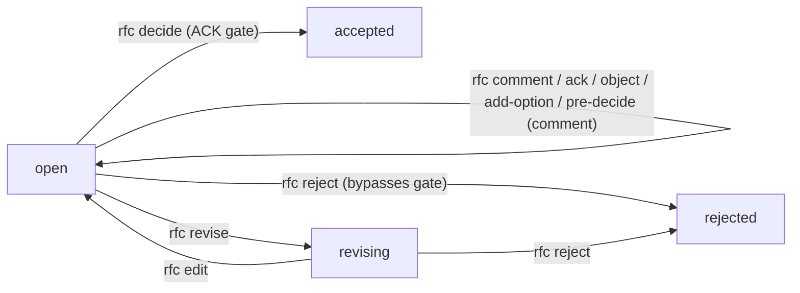

# RFC mechanism — end-to-end guide

Cross-references: [PROTOCOL](./PROTOCOL.md) for exact command semantics,
[SCHEMA](./SCHEMA.md) for on-disk shapes, [HANDBOOK](./HANDBOOK.md) for
when (not) to open an RFC.

This document is the narrative companion to those references. It covers
the model, the lifecycle, the on-disk layout, the per-role visibility
rules, and a worked end-to-end simulation that exercises the full RFC
surface: structured pre-decision comments, mandatory ACK gate,
multi-round discussion with threading, mid-discussion add-option, and a
revise → edit cycle.

Pre-decide is modelled as a structured **comment kind** with a hard
**ACK gate** on `decide`: every required role must explicitly
`rfc ack` or `rfc object` before the decider can finalise. Silence
never counts as consent.

---

## 1. What an RFC is, and why it exists

RFC = Request For Comments. It gives "decisions that cross multiple
roles' `owns`" a structured paper trail so that no single agent
unilaterally changes something other agents are responsible for.

Where it sits among the other channels:

| Channel  | Use for                                                                            | Visible to                        |
|----------|------------------------------------------------------------------------------------|-----------------------------------|
| chat     | non-durable. If it matters, it goes elsewhere.                                     | only that window                  |
| worklog  | broadcast progress note ("I changed config X").                                    | every role                        |
| report   | directed request ("Backend, please ship feature Y").                               | one role                          |
| **RFC**  | **a decision that needs comments from several roles and explicit sign-off**.       | voters + deciders + creator       |

An RFC is **not**:

- a vote (no automatic tally; the decider picks, period),
- a discussion forum (use worklogs / reports for that),
- a way to nag others (use reports),
- a way to formalise something inside your own `owns` (just do it).

---

## 2. Three participation roles, per RFC

Each RFC partitions the project's roles at **creation time**:

| Bucket          | Set by                                                  | What they can do                                                                                  |
|-----------------|---------------------------------------------------------|---------------------------------------------------------------------------------------------------|
| **creator**     | implicit (`GOJAJA_SESSION` role, or `SYSTEM`)               | call `rfc new`; rewrite via `rfc edit` while `revising`. **Also added to `voters` automatically** (see below). |
| **voters**      | `--voters X,Y` ∪ `{creator}` (deduped; creator always included unless `SYSTEM`) | should comment; **must `ack` or `object` whenever there is an active pre-decision** (see §3).     |
| **deciders**    | `--deciders Z` (required, non-empty)                    | the **only** roles that can call `rfc pre-decide` / `rfc decide` / `rfc reject` / `rfc revise`. **Must also `ack` or `object` when another decider pre-decides** (see §3). |

Opening an RFC asserts interest in its outcome, so the creator is
automatically a voter (no opt-out). They see manifest events for the
RFC AND owe an ack/object on any pre-decision (unless they are
themselves the pre-decider, in which case the ACK gate excludes them
as usual). SYSTEM-created RFCs don't auto-include SYSTEM because
SYSTEM isn't a role; the voters list is then exactly what was passed
in `--voters`.

Roles in none of these buckets do not see the RFC in their manifest.
They can still inspect with `gojaja rfc show <id>` (reads are
unrestricted) but it does not draw their attention.

Decider scope is **per-RFC**, set at `rfc new` time. There is no
role-level "default decider" flag.

---

## 3. The ACK gate (heart of the RFC mechanism)

Pre-decide is a structured **comment** with `kind: "pre-decision"`. It
does NOT change RFC status; status stays `open`. What it does:

**The Required-ACK set.** When a decider posts a pre-decision, every
role in `(voters ∪ deciders) − {pre-decider}` becomes a required
responder. Each must run one of:

```bash
gojaja rfc ack <rfc-id>                                  # I agree
gojaja rfc object <rfc-id> --rationale "..." [--option Y] # I disagree
```

before `gojaja rfc decide` will succeed. The gate is enforced inside
`decideRfc`:

> RFC RFC-0001 has an active pre-decision (option 'C' by TL);
> waiting for ACK from: DevOps, PM. Each role must run `gojaja rfc
> ack RFC-0001` or `gojaja rfc object RFC-0001 --rationale ...`
> before this RFC can be decided. There is no override; if a role is
> unreachable, run `gojaja rfc reject RFC-0001 --rationale ...`
> and open a new RFC without that role in voters/deciders.

**No silence = consent.** Silence (or only regular `rfc comment`
posts) does NOT advance the gate. The decider has machine-clear
knowledge of every required role's position before they can decide.

**No override.** There is no `--force` or `--override` flag. If a
required role is unreachable (agent offline / role deleted), the only
escape is `rfc reject` followed by a fresh RFC without that role in
voters/deciders.

**Re-posting `rfc pre-decide` invalidates all prior ack/object.**
If the decider needs to change their proposal mid-round, they re-issue
`rfc pre-decide` (same or different option). Prior ACKs/objections
become moot — every required role must respond to the new pre-decision.
Same goes if `chosenOption` is unchanged: re-posting always reopens
the ACK round (because rationale may have changed, and we keep the
rule simple).

**`add-option` during pending pre-decide silently invalidates it.**
A non-decider can `rfc add-option` while a pre-decision is pending.
This silently invalidates the pre-decision because voters were ACKing
a now-outdated option set. The decider can re-issue `rfc pre-decide`
once ready. The existing `RFC_OPTION_ADDED` event provides the audit
signal; no separate "invalidated" event.

**The pre-decider can't ACK their own pre-decision.** Implicit; the
pre-decider already stated their position by posting the pre-decision.

**Other deciders are in the required set.** If there are multiple
deciders, every decider except the pre-decider must ack/object too.
This makes "multi-decider RFC" actually consensus-aware.

---

## 4. Lifecycle and state machine



Five statuses (`pre-decide` removed):

- `open` — discussion + pre-decide + ACK happen here.
- `revising` — decider sent the proposal back for rewrite (`rfc revise`); creator or any decider can `rfc edit` to update and re-open.
- `accepted` / `rejected` / `superseded` — terminal. `superseded` is reserved (no command produces it in v2).

The framework does NOT auto-expire open RFCs. `deadline` is decorative.

---

## 5. On-disk layout

```
.gojaja/
  config.yaml                                       # rfcCounter: N
  rfcs/RFC-NNNN-<slug>/
    proposal.yaml                                   # carries status, description, relatedTasks
    comments.yaml                                   # append-only threaded ledger; structured kinds live here
    decision.json                                   # absent until a decider acts; terminal
  comms/cursors/<role>/rfc-<rfc-id>.json            # per-role read marker for unreadComments
  comms/events/<ulid>.json                          # RFC_* events
```

`RFC-NNNN` is allocated atomically from `config.yaml:rfcCounter` under
the shared `config-yaml` lock. `slug` is checked for global uniqueness.

A representative `proposal.yaml` (note: no `preDecision` field — see §3):

```yaml
id: RFC-0001
slug: switch-to-postgres
title: Move primary store from SQLite to Postgres
status: open                                # open | revising | accepted | rejected | superseded
voters: [DevOps, PM]
deciders: [TL]
options:
  - id: A
    summary: "Migrate now (4 weeks)"
  - id: B
    summary: "Add WAL tuning to SQLite first"
deadline: null
createdAt: 2026-05-28T03:18:42.117Z
createdBy: Backend
description: |
  Login latency tracked back to SQLite write contention. Both options
  below are tractable; this RFC picks one.

  A: Migrate to Postgres on managed RDS. ~4 weeks; needs DevOps to
  stand up clusters.
  B: Tune SQLite WAL + busy-timeout. ~2 days; ceiling 3-4x current
  throughput.
relatedTasks: [T-0042]
```

A representative `comments.yaml` (position-statement comments carry
`kind`):

```yaml
- id: 01HZA000000000000000COMM1
  rfcId: RFC-0001
  role: DevOps
  ts: 2026-05-28T05:02:00.000Z
  preferred: A
  replyTo: null
  rationale: "Migration is tractable; Postgres is already in staging."
  # no kind = regular discussion comment

- id: 01HZA000000000000000COMM2
  rfcId: RFC-0001
  role: TL
  ts: 2026-05-28T05:30:00.000Z
  preferred: A
  replyTo: null
  rationale: "Lean A; speak up if not."
  kind: pre-decision

- id: 01HZA000000000000000COMM3
  rfcId: RFC-0001
  role: DevOps
  ts: 2026-05-28T05:35:00.000Z
  preferred: A
  replyTo: 01HZA000000000000000COMM2
  rationale: ""
  kind: ack

- id: 01HZA000000000000000COMM4
  rfcId: RFC-0001
  role: PM
  ts: 2026-05-28T05:42:00.000Z
  preferred: B
  replyTo: 01HZA000000000000000COMM2
  rationale: "Prefer B; M2 slip is hard to justify."
  kind: object
```

A representative `decision.json`:

```json
{
  "rfcId": "RFC-0001",
  "decidedBy": "TL",
  "ts": "2026-05-28T07:42:11.443Z",
  "outcome": "accepted",
  "chosenOption": "A",
  "rationale": "PM objection noted but milestone slack is real; proceeding with A."
}
```

Event types (all broadcast `to: "*"`):

| Event                          | Triggered by                                                                                          |
|--------------------------------|-------------------------------------------------------------------------------------------------------|
| `RFC_CREATED`                  | `gojaja rfc new`                                                                                    |
| `RFC_COMMENT`                  | `gojaja rfc comment` / `ack` / `object` / `pre-decide` (payload carries `kind`)                     |
| `RFC_OPTION_ADDED`             | `gojaja rfc add-option` — also implicitly invalidates any pending pre-decision                      |
| `RFC_REVISION_REQUESTED`       | `gojaja rfc revise`                                                                                 |
| `RFC_REVISED`                  | `gojaja rfc edit`                                                                                   |
| `RFC_DECIDED`                  | `gojaja rfc decide` / `rfc reject`                                                                  |
| `RFC_TASK_LINKED` / `RFC_TASK_UNLINKED` | `gojaja rfc link-task` / `unlink-task`                                                     |
| `RFC_REPAIRED`                 | self-heal when a half-written decide is detected on read                                              |

Pre-decision and objection signals piggyback on `RFC_COMMENT` via
`payload.kind` rather than dedicated event types.

---

## 6. Command reference

All commands need `GOJAJA_SESSION` exported.

| Command                                                                                                | Who                                | Notes                                                                                       |
|--------------------------------------------------------------------------------------------------------|------------------------------------|---------------------------------------------------------------------------------------------|
| `rfc new <slug> --title T --deciders D --options "A:s,B:s" [--description D] [--voters V] [--task T] [--deadline ISO]` | any session | slug unique; `--deciders` non-empty; soft warn if `--description` empty                     |
| `rfc comment <rfc-id> --rationale R [--option X] [--reply-to <comment-id>]`                            | any session                        | regular discussion comment (no kind). Does NOT count toward ACK gate.                       |
| `rfc add-option <rfc-id> --option <id>:<summary> --rationale R`                                        | any session                        | RFC `open` or `revising`; option id unique; **invalidates any pending pre-decision**        |
| `rfc pre-decide <rfc-id> --option X --rationale R`                                                     | decider only                       | posts a `kind: "pre-decision"` comment; arms the ACK gate                                   |
| `rfc ack <rfc-id> [--rationale R]`                                                                     | required-ACK role (not pre-decider) | structured agreement with the active pre-decision                                          |
| `rfc object <rfc-id> --rationale R [--option Y]`                                                       | required-ACK role (not pre-decider) | structured objection; optional preferred alternative                                       |
| `rfc decide <rfc-id> --option X --rationale R`                                                         | decider only                       | enforces ACK gate if there's an active pre-decision                                         |
| `rfc reject <rfc-id> --rationale R`                                                                    | decider only                       | **bypasses ACK gate** — only escape from a stalled pre-decision                             |
| `rfc revise <rfc-id> --rationale R`                                                                    | decider only                       | RFC `open` → `revising`                                                                     |
| `rfc edit <rfc-id> --rationale R [--title T] [--description D] [--options A:s,B:s] [--deadline ISO]`   | creator OR decider                 | RFC `revising` → `open`; at least one field                                                 |
| `rfc link-task <rfc-id> --task T-NNNN`                                                                 | any session                        | task must exist; idempotent; refused in terminal states                                     |
| `rfc unlink-task <rfc-id> --task T-NNNN`                                                               | any session                        | idempotent; refused in terminal states                                                      |
| `rfc list [--status open|revising|accepted|rejected|superseded]`                                       | anyone                             | reads on-disk only                                                                          |
| `rfc show <rfc-id> [--no-mark-seen]`                                                                   | anyone                             | side effect: advances caller's per-RFC read cursor unless `--no-mark-seen`                  |

Exit codes: `FORBIDDEN` (9) for non-decider calling pre-decide /
decide / reject / revise; `USAGE` (2) for state-machine guards and
ACK gate refusals.

---

## 7. What appears in `gojaja plan`

`plan` returns `manifest.rfcs: RfcSummary[]` per role. The rules:

1. Consider RFCs whose `status ∈ {open, revising}`.
2. Drop any RFC where the role is in none of `voters`, `deciders`, or
   `createdBy`.
3. Compute `pendingPreDecision` from the comments ledger (latest
   `kind: "pre-decision"` comment, not invalidated by a later
   `RFC_OPTION_ADDED`).
4. Per-state visibility:
   - **`open`** + pending pre-decision + `myAckOwed` for this role → keep (this role has a structured task).
   - **`open`** + pending pre-decision + already responded → keep for deciders; drop for voters (their work is done until decide).
   - **`open`** + no pending pre-decision → standard rule: drop voter (not also decider) who has commented AND has zero unread.
   - **`revising`** → keep creator + deciders; drop other voters.

Each entry shape:

```ts
{
  id: "RFC-0001",
  title: "...",
  status: "open" | "revising",
  role: "voter" | "decider",
  commented: boolean,
  unreadComments: number,
  relatedTasks: string[],
  pendingPreDecision?: {
    decidedBy: RoleId;
    chosenOption: string;
    ts: string;
    rationale: string;
    awaitingAckFrom: RoleId[];   // outstanding roles
    myAckOwed: boolean;          // for the role this manifest belongs to
  };
}
```

`gojaja rfc comment` and `rfc ack` / `rfc object` automatically
advance the commenter's read cursor. `gojaja rfc show` advances it
explicitly (unless `--no-mark-seen`).

---

## 8. End-to-end simulation

Four roles:

```bash
gojaja role create PM       "Product Manager"   --owns "state/project_state.md,state/task_board.yaml"
gojaja role create TL       "Tech Lead"         --owns "state/architecture.md"  --reports-to PM
gojaja role create Backend  "Backend Engineer"  --owns "src/api/,src/db/"        --reports-to TL,PM
gojaja role create DevOps   "DevOps"            --owns "infra/"                  --reports-to TL
```

PM has assigned task `T-0042 Improve login latency` to Backend. Backend
concludes the root cause is SQLite under write contention; the right
fix is migrating to Postgres.

### Turn 1 — Backend opens the RFC

```bash
$ gojaja rfc new switch-to-postgres \
    --title       "Move primary store from SQLite to Postgres" \
    --description "Login latency root-caused to SQLite contention; A is the migration, B is a tuning band-aid." \
    --options     "A:Migrate now (4 weeks),B:WAL tuning first" \
    --voters      "DevOps,PM" \
    --deciders    "TL" \
    --task        T-0042

Created RFC-0001 (open): Move primary store from SQLite to Postgres
  voters:        DevOps, PM
  deciders:      TL
  options:       A, B
  relatedTasks:  T-0042

$ gojaja task status T-0042 Blocked
$ gojaja ack --token <plan-token>
$ gojaja wait
```

### Turn 2 — Discussion (regular comments + add-option)

DevOps leaves an early discussion comment:

```bash
$ gojaja rfc show RFC-0001        # advances read cursor
$ gojaja task show T-0042
$ gojaja rfc comment RFC-0001 --option A \
    --rationale "Postgres already in staging; migration is straightforward."
```

PM replies under DevOps's comment:

```bash
$ gojaja rfc comment RFC-0001 \
    --reply-to 01HZA000000000000000COMM1 \
    --rationale "Can M2 slip 2 weeks if needed?"
```

Backend realises neither A nor B captures "managed Postgres" and adds
option C:

```bash
$ gojaja rfc add-option RFC-0001 \
    --option "C:Managed Postgres on RDS with phased cutover" \
    --rationale "A is too binary; this carves out the operational angle."
```

### Turn 3 — TL pre-decides; ACK gate enforces consensus

TL reads the full picture and posts a pre-decision:

```bash
$ gojaja rfc show RFC-0001        # advances TL's read cursor
$ gojaja rfc pre-decide RFC-0001 --option C \
    --rationale "Lean C; this captures DevOps's operational concern."
Posted pre-decision on RFC-0001 as option 'C' by TL (comment 01HZA...COMM5).

Required ACK from: DevOps, PM.
Each role must run `gojaja rfc ack RFC-0001` or `gojaja rfc object RFC-0001 --rationale ...`
before `gojaja rfc decide RFC-0001 --option C --rationale ...` will succeed.
Silence does NOT count as consent. The only escape from a stalled ACK round is
`gojaja rfc reject RFC-0001`.
```

TL tries to decide immediately and is refused:

```bash
$ gojaja rfc decide RFC-0001 --option C --rationale "go"
USAGE: RFC RFC-0001 has an active pre-decision (option 'C' by TL);
waiting for ACK from: DevOps, PM. ...
```

DevOps acks:

```bash
$ gojaja rfc ack RFC-0001
Acked the active pre-decision on RFC-0001 as DevOps (comment 01HZA...COMM6).
```

PM has a budget concern and objects:

```bash
$ gojaja rfc object RFC-0001 \
    --rationale "Managed RDS adds ~\$400/mo; not budgeted this quarter."
Objected to the active pre-decision on RFC-0001 as PM (comment 01HZA...COMM7).
```

### Turn 4 — Discussion + TL re-pre-decides; ACK gate re-arms

PM's objection is in the audit trail; TL reads it and chats with PM via
report. PM clears the budget concern in a follow-up comment:

```bash
$ gojaja rfc comment RFC-0001 \
    --option C \
    --reply-to 01HZA...COMM7 \
    --rationale "Confirmed: $400/mo fits next quarter's budget."
```

This regular comment does NOT advance the gate (PM still has an
outstanding `object` recorded). To clear PM's objection, TL re-pre-decides:

```bash
$ gojaja rfc pre-decide RFC-0001 --option C \
    --rationale "Re-issue: PM's budget concern resolved per comment 01HZA...COMM8."
```

This re-publish invalidates both DevOps's earlier ack AND PM's earlier
object. Everyone re-ACKs:

```bash
# DevOps
$ gojaja rfc ack RFC-0001
# PM
$ gojaja rfc ack RFC-0001
```

### Turn 5 — TL finalises

```bash
$ gojaja rfc decide RFC-0001 --option C \
    --rationale "All required roles ACKed second pre-decision."
Accepted RFC-0001 (option C) by TL.
```

### Turn 6 — Downstream tasks

- **DevOps** stands up RDS staging.
- **PM** updates `state/project_state.md`.
- **Backend** spawns sub-tasks:

  ```bash
  $ gojaja task new --title "Provision Postgres RDS staging"      --owner DevOps  --depends-on T-0042
  $ gojaja task new --title "Schema migration scripts"            --owner Backend --depends-on T-0042
  $ gojaja task new --title "Cutover plan and rollback"           --owner Backend --depends-on T-0042
  $ gojaja task status T-0042 InProgress
  ```

Audit chain (events, oldest first):

```
RFC_CREATED                                     (Backend)
RFC_COMMENT (kind=undef)                        (DevOps, "Postgres in staging")
RFC_COMMENT (kind=undef)                        (PM,     "M2 slip 2 weeks?")
RFC_OPTION_ADDED                                (Backend, option C)
RFC_COMMENT (kind=pre-decision)                 (TL, option C, "Lean C")
RFC_COMMENT (kind=ack)                          (DevOps)
RFC_COMMENT (kind=object)                       (PM, "$400/mo not budgeted")
RFC_COMMENT (kind=undef)                        (PM, "Confirmed budget fits")
RFC_COMMENT (kind=pre-decision)                 (TL, option C, "Re-issue")
RFC_COMMENT (kind=ack)                          (DevOps)
RFC_COMMENT (kind=ack)                          (PM)
RFC_DECIDED                                     (TL, accepted, option C)
```

---

## 9. Edges that bite

1. **`--description` is soft-required.** Empty descriptions pass
   with a warning; a future release will harden to required.
2. **Regular comment from required-ACK role does NOT advance the gate.**
   Discussion is welcome; you still owe a structured `ack` or `object`.
3. **Re-publishing `rfc pre-decide` invalidates ALL prior ACKs**, even
   if `chosenOption` is unchanged. Voters must respond again.
4. **`add-option` while pending silently invalidates the pre-decision.**
   The `RFC_OPTION_ADDED` event is the audit signal. Decider can
   re-pre-decide on the new option set.
5. **Pre-decider cannot ack their own pre-decision.** They already
   stated their position by posting it.
6. **Multi-decider RFCs are stricter.** Other deciders are in the
   required-ACK set; they must explicitly ack/object before the
   pre-decider can finalise.
7. **No override.** If a required role is unreachable, the only escape
   is `rfc reject` + open a new RFC without that role in voters/deciders.
8. **`relatedTasks` must point at real tasks.** Validated at write time.
9. **`superseded` has no command.** Document supersession in a new
   RFC's rationale.

---

## 10. When to reach for an RFC

The handbook codifies this; short version:

**Open an RFC when** the choice
- touches multiple roles' `owns` simultaneously, OR
- changes architecture, API contracts, data model, or rollback story, OR
- depends on opinions you cannot collect from a single role.

**Send a report instead when** the question has a single role that
can answer it.

**Just do it (no RFC, no report) when** the choice is entirely inside
your own `owns` and only needs acknowledgement.

Within an RFC:

- Use **pre-decide** whenever the decision is non-trivial — it forces
  every required role on the record.
- Use **revise** when the topic is real but the writeup is too thin.
  Use **reject** when the topic itself is wrong OR a required role is
  unreachable.
- Use **add-option** the moment you realise the existing options are
  inadequate.
- Use **`--reply-to`** when reacting to a specific point.

### Brainstorm mode (RFC with no options)

When the question is "what should we even do about X?" — no concrete
choices on the table yet — open an RFC **without** `--options`:

```bash
gojaja rfc new q3-priorities \
  --title "Q3 priorities — what should we be optimising for?" \
  --deciders <leader-role> --voters <r1,r2,r3> \
  --description "..."
```

The RFC opens in `open` status with `options: []`. Voters post
comments (ideas, risks, follow-ups) freely; replies thread via
`--reply-to`. The pre-decide / ACK gate is inert (pre-decide refuses
on an options-empty RFC and points at `add-option`).

Two ways the RFC can close:

1. **Discussion converges on a concrete choice.** Anyone runs
   `gojaja rfc add-option <id> --option X:summary --rationale "..."`
   to add it. From that point on, the RFC behaves like a normal
   decision RFC: `rfc decide` requires `--option <X>`, `rfc pre-decide`
   works again, the ACK gate arms when pre-decide is called.

2. **Discussion concludes without a specific choice.** The decider
   runs `gojaja rfc decide <id> --rationale "<takeaway>"` (no
   `--option`). The decision is `accepted` with `chosenOption: null`;
   the rationale carries the substance of the conclusion (e.g.
   "Q3 stays focused on perf; deferring the auth rewrite to Q4").

A brainstorm RFC that needs to die without consensus runs
`gojaja rfc reject <id> --rationale "<why>"`. Same as a decision
RFC reject: `chosenOption: null`, `outcome: "rejected"`.

The brainstorm flavour is the same primitive — same on-disk layout,
same threading, same `unreadComments` accounting, same manifest
plumbing — only the `options` array is empty until someone adds one.

---

## 11. Relationship to other mechanisms

- **Tasks**: link at creation with `--task T-NNNN` (or post-hoc with
  `rfc link-task`). After `RFC_DECIDED`, spawn `task new` entries.
- **Reports**: announce an RFC's existence to a specific role
  (especially `pre-decide` to required-ACK roles who are slow).
- **Worklog**: post-decision context that does not produce its own
  event. Don't echo the decision back.
- **State files**: a decision changes intent; updating
  `state/architecture.md` / `state/project_state.md` is the separate
  act the relevant role's `state edit` performs after the RFC closes.
